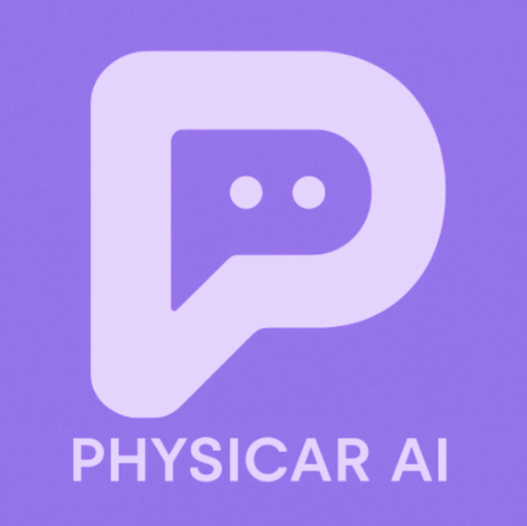

# PhysiCar Cloud

Provides an environment to practice [**PhysiCar AI**](https://physicar.ai) in a cloud environment (GitHub Codespaces).

클라우드 환경 (Github Codespaces) 에서 [**PhysiCar AI**](https://physicar.ai) (피지카 에이아이)를 실습하는 환경을 제공합니다.

## About PhysiCar AI

[**PhysiCar AI**](https://physicar.ai) is a fast and easy creative physical AI education platform.

[**피지카 에이아이**](https://physicar.ai)는 쉽고 빠른 창작형 피지컬 AI 교육 플랫폼입니다.

## Quick Start

| Cloud Name | Branch | PhysiCar Versions | Codespaces |
|--------|-------------|-----------|-----------|
| **Agent** | [`agent`](../../tree/agent) | **v1** | coming soon |
| **DeepRacer** | [`deepracer`](../../tree/deepracer) | **v1** | coming soon |
| **Pose Control** | [`pose-control`](../../tree/pose-control) |  **v1** | coming soon |
| **Follow** | [`follow`](../../tree/follow) |  **v1** | coming soon |
| **ROS2 (jazzy)** | [`ros2-jazzy`](../../tree/ros2-jazzy) | **v1** | coming soon |
| **ROS (noetic)** | [`ros-noetic`](../../tree/ros-noetic) | **v1** |  |

## About Codespaces

GitHub Codespaces is a cloud-hosted development environment. You can start developing immediately in your web browser without any local setup.

GitHub Codespaces는 클라우드에서 호스팅되는 개발 환경입니다. 웹브라우저로 별도의 로컬 환경 설정 없이 즉시 개발을 시작할 수 있습니다.

<!-- ### Pricing

GitHub Codespaces is billed based on compute (CPU) and storage usage. Compute is charged at **$0.09 per core per hour**.  
GitHub Codespaces는 컴퓨팅(CPU)과 스토리지 사용량에 따라 요금이 부과됩니다. 컴퓨팅 요금은 **코어당 시간당 $0.09**입니다.

| Resource | Unit | Price |
|----------|------|-------|
| **Compute (4-core)** | per hour | $0.36 |
| **Compute (8-core)** | per hour | $0.72 |
| **Compute (16-core)** | per hour | $1.44 |
| **Storage** | per GB/month | $0.07 |

> 💡 **Tip**    
> Stop your codespace when not in use to save core hours.  
> 사용하지 않을 때는 코드스페이스를 중지하여 코어 시간을 절약하세요. -->

### Free Tier

GitHub provides a monthly free tier for Codespaces based on your plan.  
GitHub는 플랜에 따라 매월 Codespaces 무료 사용량을 제공합니다.

| Plan | Core Hours (Monthly) | Storage |
|------|---------------------|---------|
| **Free** | 120 core-hours | 15 GB |
| **Pro** | 180 core-hours | 20 GB |

Available free tier hours by machine type are as follows:  
머신 타입에 따른 프리티어 사용 가능 시간은 다음과 같습니다.

| Machine Type | Free Plan | Pro Plan |
|--------------|-----------|----------|
| **4-core** | 30 hours | 45 hours |
| **8-core** | 15 hours | 22.5 hours |
| **16-core** | 7.5 hours | 11.25 hours |

### States

- **Available**

    - The codespace is running. It shows as  next to the codespace name.  
        코드스페이스가 실행중인 상태입니다. 코드스페이스 이름 옆에  라고 표시되어 있습니다.
    - Creating a new codespace or reconnecting to a ShutDown codespace will set it to Available.  
        코드스페이스를 새로 생성하거나 ShutDown된 코드스페이스에 접속하면 Available 상태가 됩니다.
    - In Available state, you are charged for both CPU and storage.  
        Available 상태에서는 CPU 및 스토리지에 대한 비용이 부과됩니다.

- **ShutDown**
    - The codespace is stopped.  
        코드스페이스가 중지된 상태입니다.
    - An Available codespace will be set to ShutDown when you click  or after a period of inactivity (default: 30 minutes).  
        실행 중이던 Available 코드스페이스를  하거나 일정 시간 (기본값 30분) 이상 활동이 없을 경우 Shutdown으로 전환됩니다.
    - In ShutDown state, you are only charged for storage.  
        ShutDown 상태에서는 스토리지 비용만 부과됩니다.

- **Deleted**
    - The codespace is permanently deleted. Deleted codespaces cannot be recovered.  
        코드스페이스가 완전히 삭제된 상태입니다. 삭제된 코드스페이스는 복구할 수 없습니다.
    - A codespace will be Deleted when you click  or after a period of inactivity (default: 30 days).  
        코드스페이스를  하거나 일정 기간 이상 (기본값 30일) 접속하지 않은 경우 Deleted 됩니다.
    - To prevent auto-deletion due to inactivity, uncheck .  
        일정 기간 이상 접속하지 않아 삭제되는 일을 방지하고 싶다면  를 체크 해제하세요.

### Machine Type

PhysiCar Cloud uses **4-core** machine by default. You can select a different machine type when creating a codespace, or change the machine type of a running codespace by clicking .

PhysiCar Cloud는 기본적으로 **4코어** 머신을 사용합니다. 코드스페이스 생성 시 다른 머신 타입을 선택하거나, 실행 중인 코드스페이스에서  을 클릭하여 변경할 수 있습니다.

